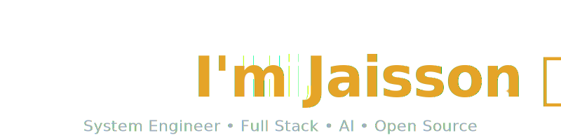

## 😎 About Me

I believe software engineering is about solving problems, not just writing code.

As a System Engineer, I enjoy designing and building scalable systems that balance simplicity, performance, and long-term maintainability. From architecture and full-stack development to cloud infrastructure, AI, and automation, I'm passionate about creating technology that delivers real value and continues to evolve over time.

I believe the best software isn't measured by its complexity, but by how naturally it solves real-world problems.

## 🎯 Current Focus

The future of software is intelligent, connected, and continuously evolving.

I'm focused on engineering systems that combine robust software architecture, artificial intelligence, automation, and cloud technologies to create products that solve real problems and remain valuable as technology changes.

## 🛠 Tech Stack

### Frontend

### Backend & Databases

### Mobile Design & Development

### DevOps, Tools & Architecture
